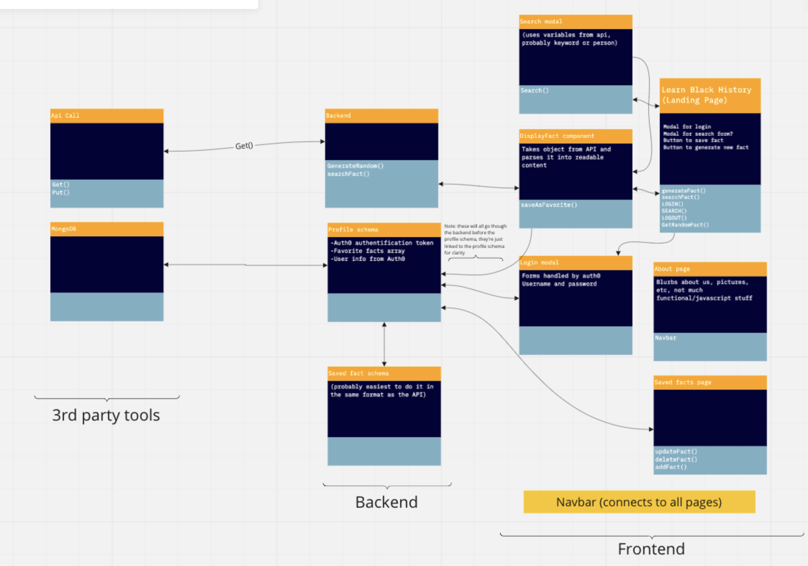
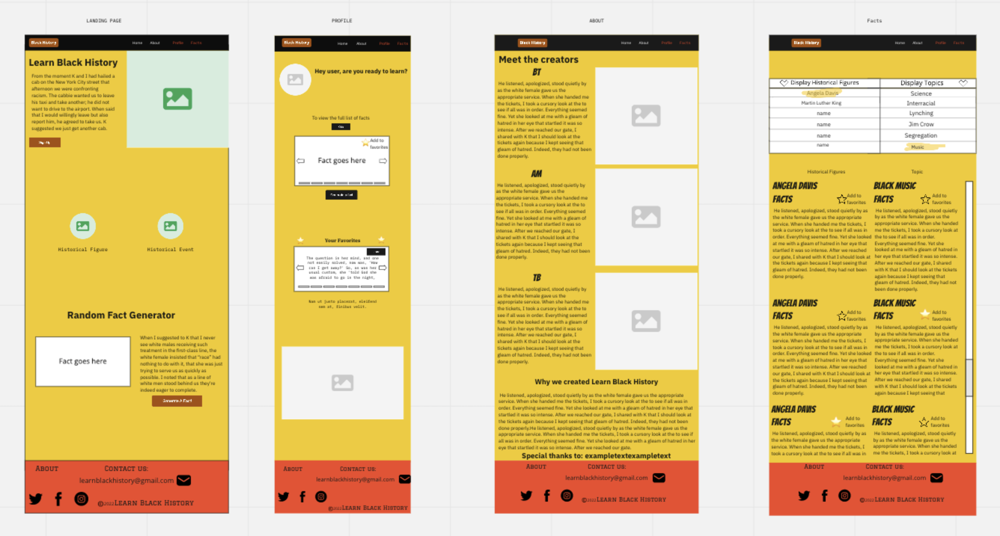
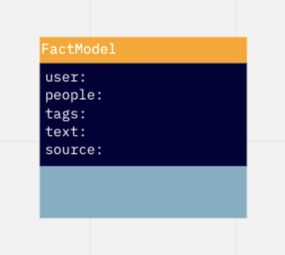

# Cooperation Plan

- ***What are the key strengths of each person on the team?***
  - T: *Driven*, Decent at CSS, ***GREAT*** communicator
  - Aoife: Skilled w/Vanilla JS, **TEAM PLAYER**
  - Brian: Mildly confident w/ CRUD, laid back, Driven
- ***How can you best utilize these strengths in the execution of your project?***
  1. Our communnication style and work ethic, will facilitate a *seamless* approach to project creation.
- ***In which professional competencies do you each want to develop greater strength?***
  - T: Become a better problem solver
  - Aoife: Better ability to communicate what code is doing
  - Brian: Also become a better problem solver
- ***Knowing that every person in your team needs to understand all aspects of the project, how do you plan to approach the day-to-day work?***
  - Start day of by discussing plan/execution
  - Start each day with a group ```git pull``` and end with a group ```ACP```

## Conflict Plan

- What will be your group’s process to resolve conflict, when it arises?
  - Be open and willing to take criticism
- What will your team do if one person is taking over the project and not letting the other members contribute?
  - Communicate openly/candidly and if not resolved, escalate!
- How will you approach each other and the challenges of the project knowing that it is impossible for all members to be at the exact same place in understanding and skill level?
  - Give each other a chance to understand the task at hand and encourage each other to code along with the driver
- How will you raise concerns to members who are not adequately contributing?
  - Communicate candidly w/each other
- How and when will you escalate the conflict if your resolution attempts are unsuccessful?
  - Reach out to Hexx or Dr. Robin if the issue cannot be resolved at the group level

## Communication Plan

- What hours will you be available to communicate?
  - For Tiara, I will be able to communicate a little earlier in the day, Brian and Aofie time, along with class time. Brian is free an hour before class and during class time. Aoife is free most of the day and during class time.
- What platforms will you use to communicate (ie. Slack, phone …)?
  - Slack & phone.
- How often will you take breaks?
  - When anyone expresses a need to do so.
- What is your plan if you start to fall behind?
  - See who can satisfy a need outside of class time or seek help from TAs or the instructor.
- How will you communicate after hours and on the weekend?
  - We will reach out on a need basis via phone.
- What is your strategy for ensuring everyone’s voice is heard?
  - Making our group an open space for expressing needs and not being judgemental towards one another even if we disagree.
- How will you ensure that you are creating a safe environment where everyone feels comfortable speaking up?
  - Reassure that everyone feels as though their needs our met if an issue is brought up within the group.

## Work Plan

- How you will identify tasks, assign tasks, know when they are complete, and manage work in general?
  - We will give everyone the same amount of time working on an issue unless someone volunteers to drive longer due to their ability to finish the feature faster. We will do tests and console.log portions of the code to make sure it is working properly before moving forward to a new feature and reference the project manager that we create.
- What project management tool will be used?
  - Trello.

## Git Process

- What components of your project will live on GitHub?
  - The entire project other than the database will live on GitHub
- How will you share the repository with your teammates?
  - Through an organization.
- What is your Git flow?
  - Start each day with a group ```git pull``` and end with a group ```ACP```.
  - Create a new branch upon the completion of a feature.
  - Merge to the staging branch once the branch is closed.
  - Once we complete the project we will merge to main.
- Will you be using a PR review workflow? If so, consider:
  - How many people must review a PR?
    - The entire team.
  - Who merges PRs?
    - The person who reviewed the PR.
  - How often will you merge?
    - Every time a feature is satisfied.
  - How will you communicate that it’s time to merge?
    - We will speak up to everyone in the group to make sure we are all on the same page.


[Software Requirements](requirements.md)
## Domain Model

 

## Wireframe



## Schema Diagram



## Project Management

[Learn Black History Trello Board](https://trello.com/b/v7wIQYZ5/learn-black-history-planning)
